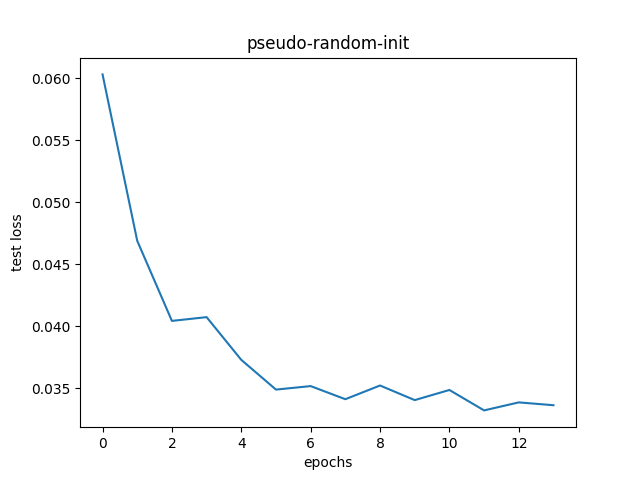

## Quantum initialization for Convolutional Neural Networks
This repository compares quantum initialization and 
pseudo-random initialization for a convolutional neural network
on the MNIST digit recognition problem.
The idea is to evaluate the quality of the pseudo-random
numbers commonly used to set up neural networks before training.
Quantum computers can produce perfect random numbers
by measuring Hadamard-transformed QBits. 
The `get_quantum_uniform` function from `qrandom.py` implements this.
In the academic
literature, this idea has previously appeared in
https://link.springer.com/article/10.1007/s00500-019-04450-0 .
The code in this repository repeats a variant of their 
CNN experiment.
This an important difference from GPU or CPU randomness, which is 
typically generated using some form of the Mersenne-Twister 
(https://en.wikipedia.org/wiki/Mersenne_Twister).

### Dependencies
The code in the repository depends on Qiskit and PyTorch.
To install these dependencies on the command line type
```
   $ pip install qiskit
   $ pip install torch torchvision 
```

### Setting up IBMQ
Head over to https://quantum-computing.ibm.com/ and set up an account.
An account token is required to run this code. Take a look at 
https://quantum-computing.ibm.com/docs/manage/account/ to learn
where to find your access key.
When you have the token open our python interpreter and run
```
 >>> from qiskit import IBMQ
 >>> IBMQ.save_account('insert your IBMQ access-token here.')
```
to set up your configuration.


## Experiments
Once the environment is set up, 
use 'mnist.py' to run the pseudo- and quantum
initialized experiments by typing
```
  $ python mnist.py --pseudo-init
  $ python mnist.py
```
to run the pseudo-random and quantum-random experiment in that order.
The second experiment will take a while, depending on the length of the quantum computer queue.

## Results
The plots below show the test set network loss for both experiments. 

### Quantum-initialization-convergence:


### Pseudorandom-initialization-convergence:

